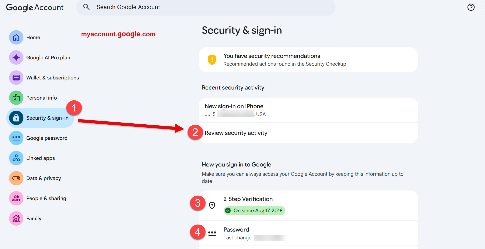

# Google Account Security

## Here is a quick guide for checking your Google account security

Secure your account quickly and easily, and verify your settings fast if you think someone has broken into your account.

### Quickly Verify Your Settings

1. Go to this URL in the browser: [myaccount.google.com](myaccount.google.com)
2. On left side menu, go to **Security and Sign-in.**
3. Review the settings. It will show when you password was last updated, and your 2-Step Authentication settings.
4. Click **Review security activity.**
5. Review the list of activity, and for anything you do not recognize, click on it, and use the button **No, Secure Account** to proceed to reset your password.

### Password

- Use a 12+ character password or passphrase that at least uses at least one of each - uppercase, lowercase, and a number. You don't have to change this very often, in fact you can leave it alone unless you think your account is compromised.
- **Instructions:** [https://support.google.com/accounts/answer/41078](https://support.google.com/accounts/answer/41078)

### 2-Factor Authentication

- Turn on 2-Step authentication. Use your mobile device, install Google app on it and use that as the other factor. This will apply when you logon to a new device. It will also significantly hamper attempts to take over your account.
- **Instructions:** [https://support.google.com/accounts/answer/185839](https://support.google.com/accounts/answer/185839)